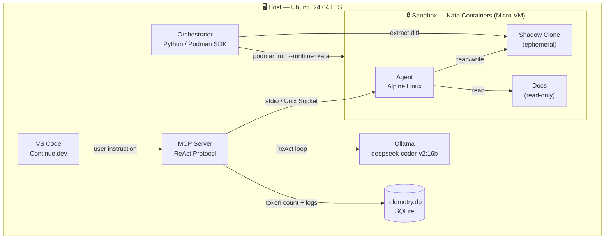
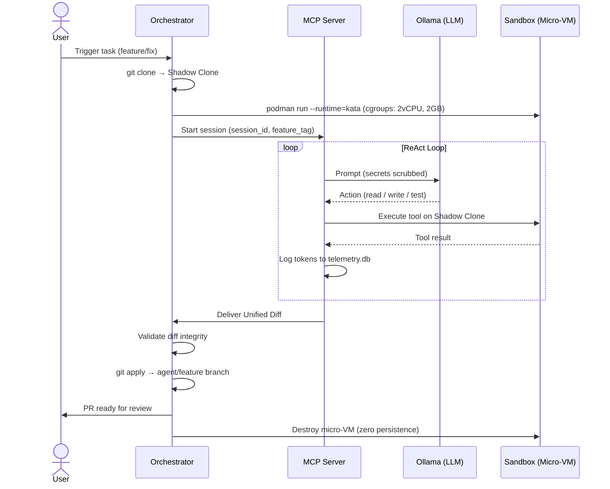
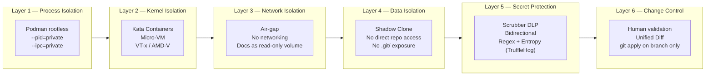
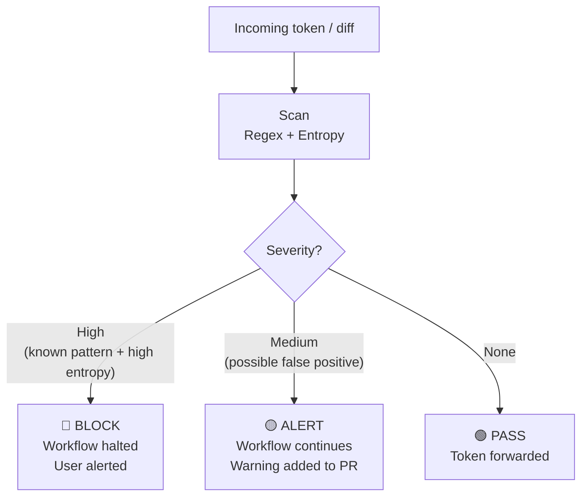
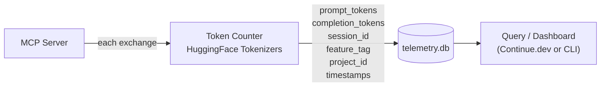

# Architecture — CLI-Agent

This document details the architecture of CLI-Agent with interactive diagrams.

---

## 1. Component Overview

---

## 2. Agent Lifecycle (Sequence)

---

## 3. Security Layers (Defense in Depth)

---

## 4. Scrubber DLP — Detection Policy

---

## 5. Telemetry Data Flow

